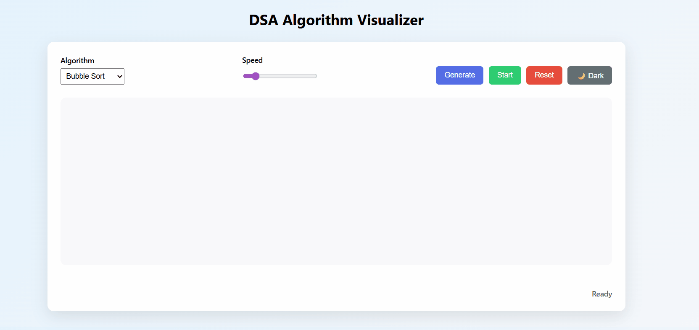

# 🧠 DSA Algorithm Visualizer

🌐 **Live Demo:**  
👉 https://dileepnarava.github.io/DSA-Algorithm-Visualizer/

A **DSA Algorithm Visualizer** built using **Java + HTML + CSS + JavaScript** to visually demonstrate how popular algorithms work **step by step**.

This project is designed for **learning, interview preparation, and portfolio showcase**.

---
## 🎥 Live Demo



## 📸 Screenshots

### Sorting Visualization


### Dark Mode UI


### Graph Algorithms


## 🚀 Features

- 🔵 Bubble Sort visualization  
- 🟣 Merge Sort visualization  
- 🔴 Quick Sort visualization  
- 🔍 Linear Search & Binary Search  
- 🌐 Graph Traversals (BFS & DFS)  
- 🎛 Real-time speed control  
- 🔽 Algorithm selection dropdown  
- 🎲 Random array generation  
- 🌙 Dark mode UI  
- 📊 Step-by-step visualization using Java-generated states  

---

## 🧩 Technologies Used

- **Java** – Algorithm implementation & step recording  
- **HTML** – UI structure  
- **CSS** – Styling & animations  
- **JavaScript** – Visualization & interaction logic  
- **Git & GitHub** – Version control & deployment  

---

## 🏗️ Project Structure

DSA-Algorithm-Visualizer/
│
├── src/
│ ├── sorting/
│ ├── searching/
│ ├── graphs/
│ └── utils/
│
├── docs/
│ ├── index.html
│ ├── style.css
│ └── script.js
│
├── assets/
│ ├── sorting.png
│ ├── searching.png
│ ├── graph.png
│ └── demo.gif
│
├── README.md
└── .gitignore

---


---

## ⚙️ How It Works

1. Algorithms are implemented in **Java**
2. Each algorithm records execution steps:
   - array state
   - compared indices (`i`, `j`)
3. Java converts steps into **JSON**
4. JavaScript reads JSON and animates bars in the browser
5. UI allows:
   - speed control
   - algorithm switching
   - reset & regeneration

---

## ▶️ How to Run Locally

### 1️ Compile Java
```bash
javac -d src src/utils/*.java src/sorting/*.java src/Main.java

2 Run Java (Generate Steps)
   java -cp src Main

3️ Run Visualizer

 Open docs/index.html

 Use Live Server

 Select algorithm → Adjust speed → Click Start

  | Algorithm     | Time Complexity | Space Complexity |
| ------------- | --------------- | ---------------- |
| Bubble Sort   | O(n²)           | O(1)             |
| Merge Sort    | O(n log n)      | O(n)             |
| Quick Sort    | O(n log n) avg  | O(log n)         |
| Linear Search | O(n)            | O(1)             |
| Binary Search | O(log n)        | O(1)             |
| BFS / DFS     | O(V + E)        | O(V)             |

🎯 Use Cases

Learning DSA visually

Interview preparation

Teaching & demonstrations

Portfolio showcase

🔮 Future Enhancements

Live Java ↔ JavaScript communication

Time & swap counters

Custom array input

Mobile-friendly UI

More graph algorithms

👨‍💻 Author

Dileep Narava
Built with ❤️ to master DSA & system thinking 

---


